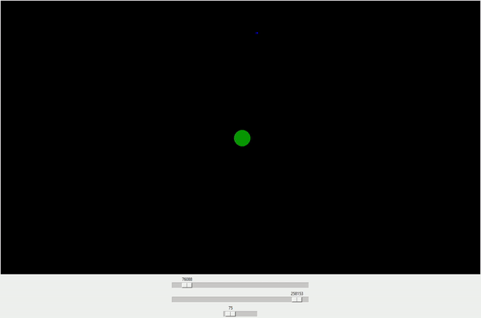

# Simple Gravity Simulator in Python

This is a simple gravity simulator written in Python. It uses the Tkinter library to display the simulation and the Universal Gravitation formula to calculate the forces between the objects.

## How to use

- add or remove objects by modifying the code in `main.py`
- `python main.py` to run the simulation
- you can accelerate the simulation with the first slider
- you can change the scale of the simulation with the second slider
- you can change the frame rate of the simulation with the third slider

## Example

